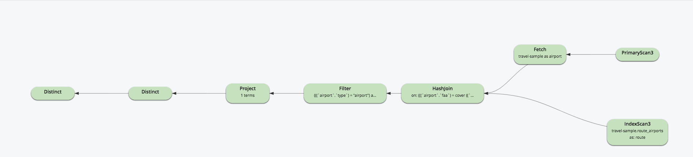

# Part 10: N1QL QUERY OPTIMIZATION IN 5.5
  
## ANSI JOIN

N1QL supports two join methods for ANSI JOIN:

- Nested-loop join as the default setting, it uses left-hand keyspace in the outer loop and for each document from the left-hand side performs an index scan on right-hand side to seek a match.

- Hash join with a build side to create hash table and a probe side to look up in the hash table. It is more efficient when the join is large and it can only be applied to equi-conditon.

The hash join can be enabled by specifing "USE HASH(build)" or "USE HASH(probe)" hints inside the join clause as shown in the qeury.

We can see the "HashJoin" operator in the explain, inside which the child operator indicates the build side of the hash join.

<pre id="example">
EXPLAIN SELECT DISTINCT route.destinationairport
	FROM   `travel-sample` airport
       		JOIN `travel-sample` route USE HASH(build)
         	ON airport.faa = route.sourceairport
            	   AND route.type = "route"
	WHERE   airport.type = "airport"
       	        AND airport.city = "San Jose";
</pre>

