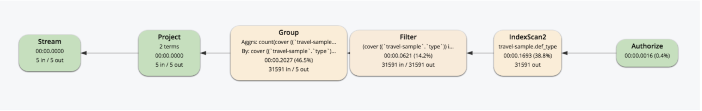
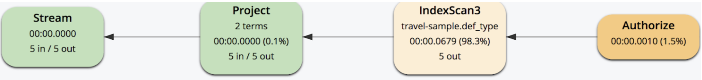

## <b> Part 10: N1QL QUERY OPTIMIZATION IN 5.5 </b>

## Index Grouping and Aggregation

In Couchbase 5.5, N1QL optimizes the performance of GROUP BY and aggregations by pushing them down to the indexer for processing. 

- It can utilize the covering index to perform GROUPING, COUNT(), SUM(), MIN(), MAX(), AVG() and related operations on-the-fly.
- Reduce the amount of data transfer and Disk I/O, achieve better performance .

We can get an idea of the new query plan through an example.

Create an index as shown on the right and try the query clause below.
 

<pre>
SELECT t.type, 
       COUNT(type) AS cnt 
FROM   `travel-sample` AS t 
WHERE  t.type IS NOT NULL 
GROUP  BY t.type 
</pre>

 
Check the comparison of the query plans before/after Couchbase 5.5 as shown below:

There is a new "index_group_aggs" operator in the IndexScan and fewer steps coming after. 

 

<pre id="example">
CREATE INDEX idx_ts_type_country_city ON `travel-sample` (type, country, city);
</pre>
 
