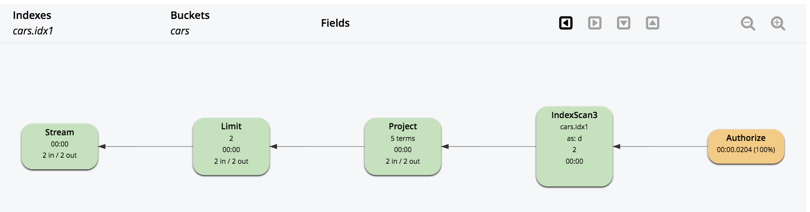

# Part 10: N1QL QUERY OPTIMIZATION IN 5.5

## Index Grouping and Aggregation

To benifit from this optimization, a good design of index to cover the query and order the index keys is essential. We will go through some examples to help understanding the right patterns.

Create a GSI index as shown in the query window.
Let's consider the following query with GROUP BY on leading index keys:

<pre>
SELECT   d.c0 AS c0, 
         	d.c1 AS c1, 
         	SUM(d.c3) AS sumc3, 
         	AVG(d.c4) AS avgc4, 
         	COUNT(DISTINCT d.c2) AS dcountc2 
FROM     cars AS d 
WHERE    d.c0 > 0 
AND      type="agg" 
GROUP BY d.c0, 
         	d.c1 
ORDER BY d.c0, 
         	d.c1 
OFFSET   1 
LIMIT    2;
</pre>

 

This query satifies the requested conditions and can be handled by indexer:

- The GROUP BY keys (d.c0, d.c1) matches exactly with the leading index keys (c0, c1).
- The aggregate contains "DISTINCT" modifier and it matches with one of the (n+1) leading index keys(n prepresents number of group keys). In this query clause, c2 is in the 3rd position. Indexer can produce full aggregation as it covers all GROUP BY keys.
- The predicate (d.c0 > 0) can be converted into range scan on the index.

Check the below execution graph for detailed process.

<pre id="example">
CREATE INDEX idx1 ON cars(c0, c1, c2, c3, c4) WHERE type="agg"
</pre>

