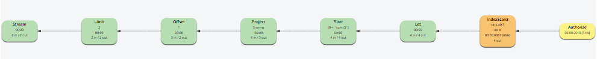

# Part 10: N1QL QUERY OPTIMIZATION IN 5.5

## Index Grouping and Aggregation

Let's consider a similar query clause with LETTING and HAVING.

The Indexer can process the GROUP BY and aggrecation in this query but can not handle LETTING and HAVING all together. 

So we can see the LET(LETTING) & FILTER(HAVING) operators coming after IndexScan and the following OFFSET and LIMIT won't be pushed down to indexer.

<pre id="example">
SELECT d.c0 AS c0, 
	d.c1 AS c1, 
	sumc3 AS sumc3,
       	AVG(d.c4) AS avgc4, 
	COUNT(DISTINCT d.c2) AS dcountc2
FROM cars AS d
WHERE d.c0 > 0 
      AND d.type="agg"
GROUP BY d.c0,
	 d.c1
LETTING sumc3 = SUM(d.c3)
HAVING sumc3 > 0
ORDER BY d.c0, 
	 d.c1
OFFSET 1
LIMIT 2;
</pre>
