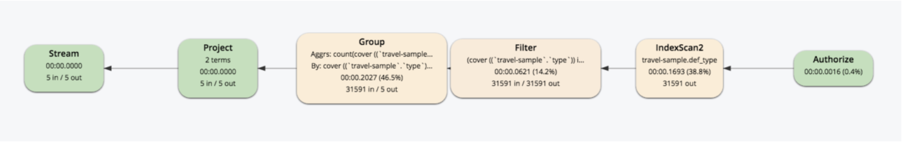

# Part 10: N1QL QUERY OPTIMIZATION IN 5.5 
  
## Index Grouping and Aggregation

Let's run the example and check the comparison of the query plans before/after Couchbase 5.5:

There is a new "index_group_aggs" operator in the IndexScan and fewer steps coming after.

<pre id="example">
EXPLAIN SELECT t.type,
       	       COUNT(type) AS cnt
	FROM   `travel-sample` AS t
	WHERE  t.type IS NOT NULL
	GROUP  BY t.type
</pre>

