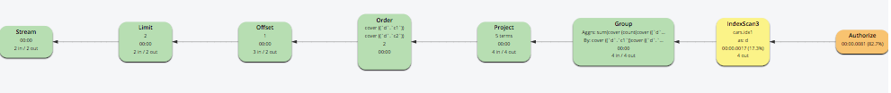

# Part 10: N1QL QUERY OPTIMIZATION IN 5.5
  
## Index Grouping and Aggregation

Let's consider an eample with GROUP BY on non-leading index keys, in which Index Grouping and Aggregation works with some limitations.

- The GROUP BY on non-leading keys (d.c1, d.c2) leads to partial aggregation, in which the scatter-gather method applies to group merge.
- LIMIT and OFFSET pushdown to Indexer is not supported with GROUP BY on non-leading keys.

Change the aggregate "COUNT(d.c2)" to "COUNT(DISTINCT d.c2)" and check the execution plan.

We can see "index_group_aggs" is disabled, thus index grouping and aggregation doesn't work in case of partial aggregation together with DISTINCT modifier.

<pre id="example">
SELECT 	d.c1 AS c1, 
	d.c2 AS c2, 
	SUM(d.c3) AS sumc3,
       	AVG(d.c4) AS avgc4, 
	COUNT(d.c2) AS countc2
FROM 	cars AS d
WHERE 	d.c0 > 0
        AND d.type="agg"
GROUP BY d.c1,
         d.c2
ORDER BY d.c1,
         d.c2
OFFSET 1
LIMIT 2;
</pre>
