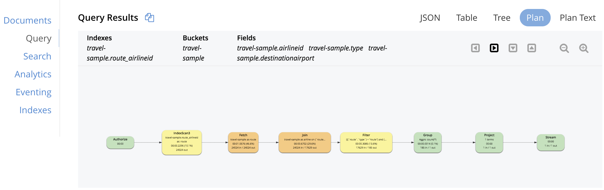

## <b> Part 10: N1QL QUERY OPTIMIZATION IN 5.5 </b>
  
## Visual Explain

Couchbase 5.5 supports the visualized explanation of N1QL query plans.
It converts the JSON-formatted result of "EXPLAIN N1QL statement" into flow chart with brief discription on top of each step and realizes a direct-viewing demonstration.

Let's consider an example of ANSI JOIN in the query window.

The visual explain "Plan" is located at the right-side of "Query Results" in the "Query" page as shown in the snapshot below:

It provides the view in four directions (left -> right, right -> left, top -> down and bottom -> up).

<pre id="example">
SELECT Count(*) AS num_airline
FROM   `travel-sample` route
       INNER JOIN `travel-sample` airline
               ON route.airlineid = Meta(airline).id
WHERE  route.type = "route"
       AND route.destinationairport = "SFO"
</pre>
~               
