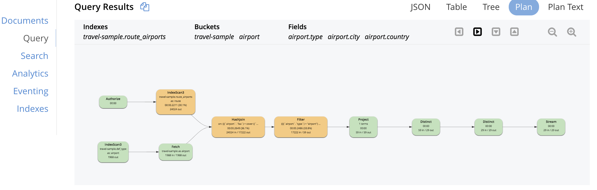

# Part 10: N1QL QUERY OPTIMIZATION IN 5.5
  
## Visual Explain

Let's enable the HASH JOIN in the last example and check the visual explanation of the query plan.

<pre id="example">
SELECT Count(*) AS num_airline
FROM   `travel-sample` route
       INNER JOIN `travel-sample` airline USE HASH(probe)
               ON route.airlineid = Meta(airline).id
WHERE  route.type = "route"
       AND route.destinationairport = "SFO"
</pre>
